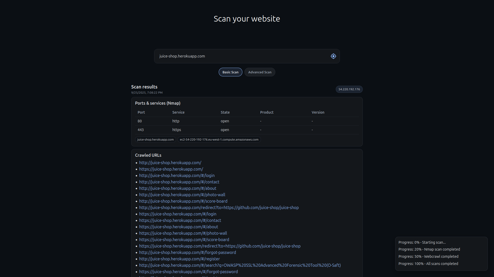

# SecTool (Recon‑only)

Simple **local** recon tool for websites. It runs an Nmap check, crawls pages, streams progress to the UI, and saves a JSON report.

> ⚠️ Use only on targets you own or have explicit permission to test. This is **not** an exploitation tool.


---

## Screenshot

scanning **OWASP Juice Shop**




---

## Features

* **Nmap**: open ports/services (backend job)
* **Web crawler**: Playwright‑based page discovery
* **Live progress**: WebSocket to the UI
* **Results saved**: `server/data/scan_results/*.json`

---

## Prerequisites

* **Ubuntu** (tested on **24.04**)
* **Node.js ≥ 18** and **npm**
* **Python ≥ 3.10**
* **Nmap installed locally**

  ```bash
  sudo apt update && sudo apt install -y nmap
  ```
* **Playwright** browsers (installed after cloning)

  ```bash
  npx playwright install
  ```

---

## Tech Stack

React • Node/Express • WebSocket • Flask • Playwright • Nmap

---

## Project Structure

```
├─ client/                     # React UI
│  ├─ src/components/scan
│  │  ├─ ScanBar.tsx          # URL + scan button
│  │  ├─ ScanProgressLog.tsx  # live WS progress
│  │  └─ ScanResults.tsx      # renders saved result
│  └─ src/pages/ScanPage.tsx
│
├─ server/                     # Node/Express API + WebSocket
│  ├─ routes/scan.js           # POST /Scan → orchestrates nmap + crawl
│  └─ utils/websocket.js       # ws://localhost:5021 (broadcast progress)
│
└─ flask_api/                  # Python side (crawler)
   └─ routes.py                # Flask endpoints (crawling / nmap proxy)
```

> The folder `server/data/scan_results/` is created automatically at runtime and should be kept empty in git (see **Keep the results folder** below).

---

## Quick Start (Local Only)

Open **two terminals** (client + server) and one for the Flask API.

**1) Client (React)**

```bash
cd client
npm install
npm run start
# http://localhost:3000
```

**2) Server (Express + WebSocket)**

```bash
cd server
npm install
npm run start
# HTTP: http://localhost:5020
# WS:   ws://localhost:5021   # root path (no /ws)
```

> The server calls `initializeWebSocket(5021)` on boot.

**3) Flask API**

```bash
cd flask_api
python3 routes.py
# exposes http://localhost:5001/api/crawling and /api/nmap
```

---

## Python virtual env + deps

```bash
cd flask_api
python3 -m venv .venv
source .venv/bin/activate
# Create requirements.txt with: flask, requests, playwright, etc.
pip install -r requirements.txt
python3 routes.py
```

---

## Configuration (.env)

Create `.env` files if you want to change ports.

**server/.env**

```
PORT_HTTP=5020
PORT_WS=5021
```

**client/.env**

```
VITE_API_URL=http://localhost:5020
VITE_WS_URL=ws://localhost:5021
```

---

## Usage

1. Open `http://localhost:3000`
2. Enter a URL or IP you’re allowed to test
3. Click **Basic Scan**
4. Watch live progress (bottom‑right); results render under **Scan results** and are also written to `server/data/scan_results/`.

---

## API / Flow

* `POST http://localhost:5020/Scan`

  * validate target → `sendProgress(0, "Starting scan…")`
  * call `http://localhost:5001/api/nmap` → `20%`
  * build crawl payload from Nmap output
  * call `http://localhost:5001/api/crawling` → `50%`
  * save combined result → `100%`
  * return the JSON (also written to disk)

**Progress WebSocket:** `ws://localhost:5021` (root path)

```json
{ "progress": 20, "message": "Nmap scan completed" }
```


## Keep the results folder in Git (but ignore outputs)

Create the folder once and keep a placeholder:

```bash
mkdir -p server/data/scan_results
printf "" > server/data/scan_results/.gitkeep
```

Add this to `.gitignore`:

```gitignore
server/data/scan_results/*
!server/data/scan_results/.gitkeep
```

The code also creates the folder **at runtime** before saving, so scans work even if the directory is missing on a fresh clone.

---

## Sample saved JSON

```json
{
  "status": "success",
  "timestamp": "2025-09-22T21:57:25.346Z",
  "tools": [
    {
      "46.137.15.86": {
        "addresses": { "ipv4": "46.137.15.86" },
        "hostnames": [
          { "name": "juice-shop.herokuapp.com", "type": "user" },
          { "name": "ec2-46-137-15-86.eu-west-1.compute.amazonaws.com", "type": "PTR" }
        ],
        "status": { "reason": "syn-ack", "state": "up" },
        "tcp": {
          "80":  { "name": "http",  "state": "open",  "product": "", "version": "" },
          "443": { "name": "https", "state": "open",  "product": "", "version": "" }
        },
        "vendor": {}
      }
    },
    {
      "crawledUrls": [
        "http://juice-shop.herokuapp.com/",
        "https://juice-shop.herokuapp.com/",
        "http://juice-shop.herokuapp.com/#/login",
        "http://juice-shop.herokuapp.com/#/contact",
        "http://juice-shop.herokuapp.com/#/about",
        "http://juice-shop.herokuapp.com/#/photo-wall",
        "http://juice-shop.herokuapp.com/#/score-board",
        "http://juice-shop.herokuapp.com/redirect?to=https://github.com/juice-shop/juice-shop",
        "https://juice-shop.herokuapp.com/#/login",
        "https://juice-shop.herokuapp.com/#/contact",
        "https://juice-shop.herokuapp.com/#/about",
        "https://juice-shop.herokuapp.com/#/photo-wall",
        "https://juice-shop.herokuapp.com/#/score-board",
        "https://juice-shop.herokuapp.com/redirect?to=https://github.com/juice-shop/juice-shop",
        "http://juice-shop.herokuapp.com/#/forgot-password",
        "http://juice-shop.herokuapp.com/#/register",
        "http://juice-shop.herokuapp.com/#/search?q=OWASP%20SSL%20Advanced%20Forensic%20Tool%20(O-Saft)",
        "https://juice-shop.herokuapp.com/#/forgot-password",
        "https://juice-shop.herokuapp.com/#/register",
        "https://juice-shop.herokuapp.com/#/search?q=OWASP%20SSL%20Advanced%20Forensic%20Tool%20(O-Saft)"
      ],
      "success": true,
      "tool": "webcrawler"
    },
    { "status": "not implemented" },
    { "status": "not implemented" }
  ]
}
```

---

## Roadmap

* Hidden directory discovery (wordlists)
* Per‑scan `scanId` isolation
* Export (JSON/CSV)

---

## Legal / Ethical

Educational use on **authorized** targets only. You are responsible for your use.

## License

MIT — see [LICENSE](./LICENSE) for full text.

Copyright (c) 2025 SecTool contributors
